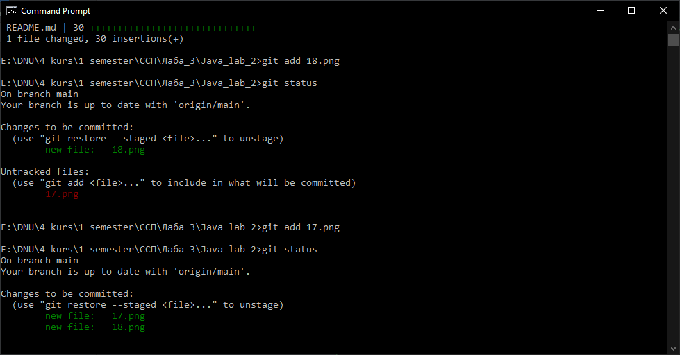

# Java_lab_2
 Composite pattern
 
 # Демонстрація основних команд роботи GitHub: #
 
 
 
 
 
 create repository:
 
 
 
 
add: 

 
 
 
 commit + status:
 
 
  
  
  publish repository:
  
 
 
 publish repository:
 
 
 
 published repository:
 
 
 
 commit:
 
 
 
 push:
 
 
 
 pushed:
 
 
 
 history:
 
 
 
 clone:
 
 
 
 clone:
 
 
 
 change README on GitHub:
 
 
 
 fetch changes:
 
 
 
 pull:
 
 
 
 history:
 
 
 
 
 
 
 
 
 
 
 
 
 
 
 
 
 
 

 
 
 
 
 
